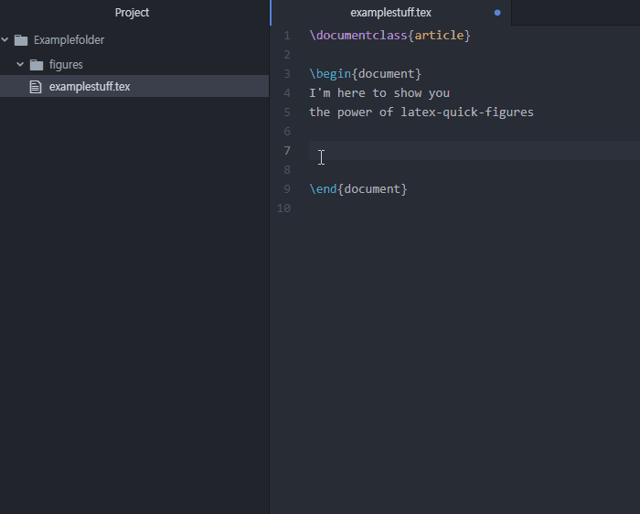
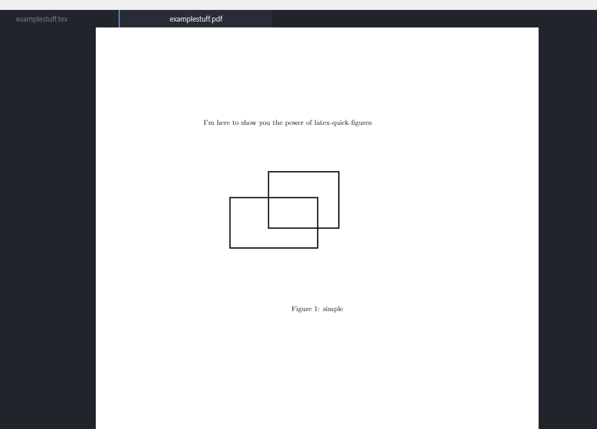

# latex-quick-figures package

Allows you to quickly add vector figures using inkscape's pdf_latex method.

1. *Make sure that you have a directory "./figures" that is at least empty.*

2. *Make sure that your inkscape program is at C:/Program Files/.*

3. *Make sure that all your directory name has no " " (space) within them*

The above prerequisite are to be solved in the future... but if you want to contribute, feel free to do so!

# How to use

First, make sure to use the following packages!!

~~~
\usepackage{import, float, pdfpages, transparent, xcolor}
~~~

In your tex file, make a single line with xy where
*x* is your template number, and *y* is your figure name.
Then, press ctr + alt + o at the end of the line , or Package->Latex Quick Figures-> Make Latex Figure
Make sure that *y* has no spaces in them or it will not be compiled into .pdf_latex format later.

Following gif will quickly make you understand. Here we write 0simple and "cmd+alt+o", meaning we will get

* In *./figures* folder, a simple.svg file with template from "imageTemplate0.svg" (Willing to add features to make more features with templates.)  
* in snippit sense, adds all the latex strings within .tex file, which can be edited from "layoutData.txt"
* Open simple.svg with *inkscape*, so you can immediately work.

Now you can also change caption, your figure position, etc... all this change within \begin{figure} ~ \end{figure} can be saved in "layoutData.txt".

Figures are currently in .svg format, so we need to compile them into pdf_latex format (which you can do manually if you want). We have a command for that, which is Package->Latex Quick Figures->Compile All Figures. (should we add keybindings for this? Let me know)

After that, we have a simple.svg, simple.pdf_tex, simple.pdf in /figures folder. Now build your tex file to get the result!

